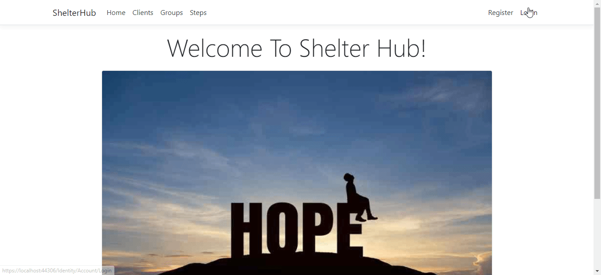
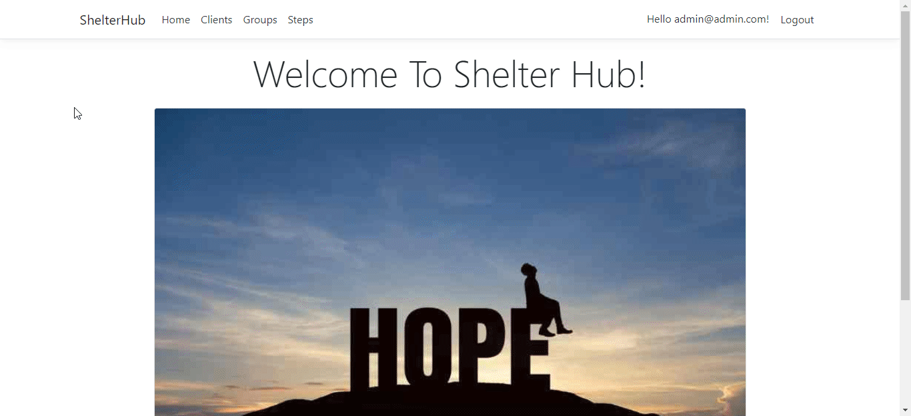

# Shelter Hub

This application was created to assist homeless and/or domestic violence shelters with keeping track of their clients' progress from the time they come in to the shelter to when they leave.

## Motivation

Most homeless and domestic violence shelters are funded through grants and private donations. Many of them struggle to keep the doors open, let alone provide services to their clients. However, most clients require in-depth counseling and step-work in order to become self-sufficent and not return to the shelter again and again after leaving. It is my hope that Shelter Hub will help shelters to more easily track the progression of clients, which in turn will open up more time for counseling and step-work, thereby increasing client self-sufficiency and cutting down on client return rates.




## Tech/Framework Used

C# Programming Language
Entity/MVC Framework
ASP.NET


## Features

- **Client Details** allows users to input client details into the database so that they can see a photo of the client and important details about the client, including an emergency contact, client phone number, and whether the client's intake is complete.
- **Groups/Steps** is where the user(shelter) can create groups for client to attend and steps for the client to work through. The user can assign groups and steps to individual clients and also display when the client completes a specific step.
- **Data Extraction** Shelter Hub can be helpful for grant funding, as a shelter can see how each client progresses through its programs. Data derived from the app will assist shelters in showing exactly how programming funds are being used. This is essential for promoting a better understanding of which programs are the most helpful for improving clients' self-sufficiency.

## Installation

This project was created using Entity and Identity Authentication. It was built in Visual Studio 2019.

### Installing the Project

Clone the source locally:
```
git clone https://github.com/jessicaayerst/Shelter-Hub.git
```

Then:
```
cd ShelterHub/
```

In the project directory, you can run:

```
start ShelterHub.sln
```
This will open the project in Visual Studio 2019

### Running the Project
Create a new database in SQL Server Object Explorer. Name it ShelterHub. Then open up Package Manager Console and run the following command:

```
PM> Update-Database
```

This will put seed data in the database so that when the app runs, there will already be clients, steps, and groups to view/edit/delete.

Now, run the app using the PLAY button in Visual Studio Code. This will open the browser to the application. Register a new username and password. Log in to the application and then start by creating some new clients, create a few groups and steps. Then you can start assigning groups to clients, etc. Try all the functions of the app and see how you like it. Please let me know if you find any bugs.


## How to Use?

1. Once you are logged in, go to the Clients page, by clicking "Clients". Here, you will see a list of current clients' first and last names, room number, an option to "Create a New Client" and options to Edit, Delete, and View Details of each client. Users can also SEARCH for a client by name in the search bar and view the list in alphabetical order by last name or chronological order by intake date.
2. Go to the Client Details page by clicking on "Details" next to the name of the client you want to view. On the Details page, you will see a photo of the client, all of the client's information, a list of groups and steps in which the client is enrolled. Users can also add more steps and groups to the client, edit a step to include a completion date, or remove a group from the client.

3. The "Groups" page will show you a list of Groups available to the clients at the shelter. Users can Create a new group or Edit/Delete/ViewDetails of a group. Users can also add a group to a client from the Groups page.
4. The "Steps" page will show a list of Steps that a client will progress through during their time at the shelter. Users can Create a new step or Edit/Delete/View Details of steps that have already been created. Users can also add a step to a client from the Steps page.


## How to Contribute?

1. Clone repo and create a new branch: $ git checkout https://github.com/jessicaayerst/Shelter-Hub.git -b name_for_new_branch.
2. Make changes and test
3. Submit Pull Request with comprehensive description of changes.


